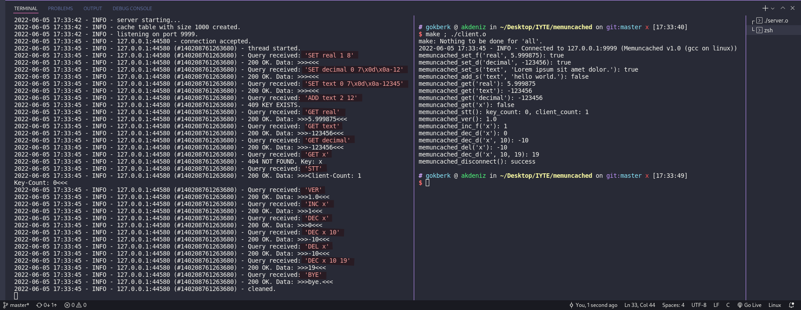
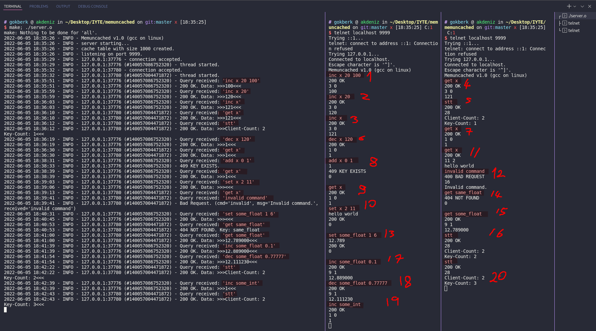

<!--PANDOC_START
---
pdf_document: null
geometry: margin=1.5cm
output: pdf_document
title: Izmir Institute of Technology
subtitle:  CENG421 Project Report
author: Gökberk Akdeniz - 250201041
date: 10.06.2022
---
PANDOC_END-->

# memuncached

_memuncached_ is the worst undistributed memory object caching system.
Its name and description are sarcasticly quoted from [___memcached___](https://memcached.org/) 
which is _free & open source, high-performance, distributed memory object caching system_.

The _memory object caching system_ is a in-memory database for storing/caching heavy-to-compute values
to speed up webservers, applications, APIs.

Although I influenced from [___memcached___](https://memcached.org/), I did not implemented their protocol but I designed myself. The commands are selected and slightly changed from [___PHP memcached client documentation___](https://www.php.net/manual/en/class.memcached.php#chunklist_reference).

The software consists of 3 parts: **server**, **client library**, **client cli**.

- As its name, **server** stores key-values in the memory and accepts TCP connections.
- The **client library** is **C library** provides **connection**, **disconnection**, and **command** implementations. 
You can think it like _database client library_.
- The **client cli** is telnet like application to connect and send commands.. You can think it like _mysql_ client cli application.

It is written in GNU dialect of ISO C11, _gnu11_.

The _server_ is written first while using _telnet_, so it is fully compatible with _telnet_. 

The _server_ handles multiple clients simulataneously thanks to _multithreading_.

Also, I published the full source code at ___[github.com/gokberkakdeniz/memuncached](https://github.com/gokberkakdeniz/memuncached)___.


## Instructions

### Requirements

- gcc
- make

Tested on `Fedora 35` using `gcc (GCC) 11.3.1 20220421 (Red Hat 11.3.1-2)`, `GNU Make 4.3`.

## Build

- cd _project\_folder_
- make
  - Available targets: _all_, _server_, _lib\_demo_, _client_. Default target: _all_.

## Usage

- Run `./server.o` to start _server_.
- Run `./lib_demo.o` to start _libmemuncached demo application_ which connects server and executes a few commands.
- Run `telnet localhost 9999` to connect the server via telnet.


<!-- pandoc \newpage -->

## Protocol

- The protocol is ASCII based. 
- The transmission is done with TCP.
- The commands are case-insensitive. 
- There 3 types of data: **decimal (0)**, **real (1)**, **string (2)**.
- If the command takes payload, its length must be sent.

## Request

There are two types of request:

- Without payload: ```{CMD} {...ARGS}\r\n```
- With payload: ```{CMD} {...ARGS} {LENGTH}\r\n{PAYLOAD}\r\n```

### Examples

```
SET mykey 3 5
abcde
```

```
get mykey
```

## Response

### Format

All responses are in the same format except one optional value, _TYPE_, which is required for **getter** (get, add) commands.


- ```{CODE} {DESCRIPTION}\r\n{LENGTH} [TYPE]\r\n{PAYLOAD}\0\r\n```

### Examples

```
200 OK
0
```

```
200 OK
3
1.0
```

```
200 OK
28
Client-Count: 1
Key-Count: 0
```

```
400 BAD REQUEST
16
Invalid command.
```

## Responses

- `200 OK`: 
- `400 BAD REQUEST`: 
- `404 NOT FOUND`:
- `405 KEY EXIST`:

<!-- pandoc \newpage -->

## Commands


| Command&nbsp;&nbsp; | Arguments&nbsp;&nbsp;&nbsp;&nbsp;&nbsp;&nbsp;&nbsp;&nbsp;&nbsp;&nbsp;&nbsp;&nbsp; | Example Responses                                             | Description                                                                                    |
| ------------------- | --------------------------------------------------------------------------------- | ------------------------------------------------------------- | ---------------------------------------------------------------------------------------------- |
| ADD                 | KEY TYPE LENGTH<br/>VALUE                                                         | <pre>405 KEY EXIST<br/>0</pre>                                | Similar to SET but fails if key exists.                                                        |
| BYE                 | -                                                                                 | <pre>200 OK<br/>4<br/>bye.</pre>                              | Close connection.                                                                              |
| DEC                 | KEY [OFFSET=1] [INITIAL=1]                                                        | <pre>200 OK<br/>1 0<br/>1</pre>                               | Decrease the value of KEY by OFFSET.<br/>If the value is empty INITIAL value will be inserted. |
| DEL                 | KEY                                                                               | <pre>200 OK<br/>5 2<br/>value</pre>                           | Deletes the value of the key and returns the value if exist.                                   |
| INC                 | KEY [OFFSET=1] [INITIAL=1]                                                        | <pre>200 OK<br/>3 1<br/>3.5</pre>                             | Increase the value of KEY by OFFSET.<br/>If the value is empty INITIAL value will be inserted. |
| GET                 | KEY                                                                               | <pre>200 OK<br/>4 2<br/>a b\\nc</pre>                         | Get the value of the key.                                                                      |
| SET                 | KEY TYPE LENGTH<br/>VALUE                                                         | <pre>200 OK<br/>0</pre>                                       | Set the value of the key.                                                                      |
| STT                 | -                                                                                 | <pre>200 OK<br/>28<br/>Client-Count: 1<br/>Key-Count: 0</pre> | Get total key count, client count etc...                                                       |
| VER                 | -                                                                                 | <pre>200 OK<br/>3<br/>1.0</pre>                               | Get server version.                                                                            |

## Future Work

### Commands

| Command&nbsp;&nbsp; | Arguments&nbsp;&nbsp;&nbsp;&nbsp;&nbsp;&nbsp;&nbsp;&nbsp;&nbsp;&nbsp;&nbsp;&nbsp; | Example Responses                          | Description                                        |
| ------------------- | --------------------------------------------------------------------------------- | ------------------------------------------ | -------------------------------------------------- |
| APP                 | KEY LENGTH<br/>VALUE                                                              | <pre>200 OK<br/>0</pre>                    | Append the value to value identified by given key  |
| PRE                 | KEY LENGTH<br/>VALUE                                                              | <pre>200 OK<br/>0</pre>                    | Prepend the value to value identified by given key |
| KYS                 | -                                                                                 | <pre>200 OK<br/>10<br/>key1<br/>key2</pre> | Get all keys                                       |

### Others

- Key validation.
- Authentication with username and password using [___crypt.h___](https://man7.org/linux/man-pages/man3/crypt.3.html).
- Unit tests.
- Better error handling and reporting for client library (instead of returning bool, return error codes).

<!-- pandoc \newpage -->

## Screenshots



